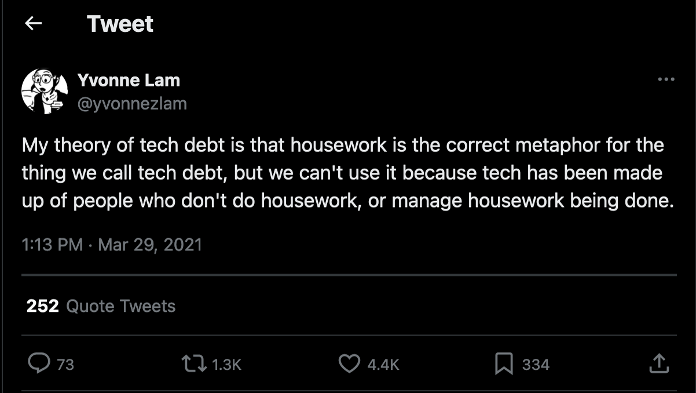

What can [Hannah Arendt's](https://plato.stanford.edu/entries/arendt/ "'Hannah Arendt', Stanford Encyclopedia of Philosophy") philosophical reflections teach us about [refactoring](/tags/refactoren/ "Blogs with the tag 'refactoren'")? Well, for one thing, why the metaphor of [technical debt](/tags/technische-schuld/ "Blogs with the tag 'technische schuld'") is misleading. But if refactoring isn't about paying off technical debt, what then is it? And what does that mean for the role refactoring can (or should?) play in our daily work?[^1]



This blog addresses three questions.

## 1. What is refactoring?

[Martin Fowler](https://martinfowler.com/), in the classic [*Refactoring*](https://martinfowler.com/books/refactoring.html), gives the following [definitions](https://martinfowler.com/bliki/DefinitionOfRefactoring.html) of the term:

> **Refactoring** *(noun)*: a change made to the internal structure of software to make it easier to understand and cheaper to modify without changing its observable behavior.
>
> **Refactoring** *(verb)*: to restructure software by applying a series of refactorings without changing its observable behavior.

"Refactoring" can be both a noun and a verb. It is both a thing and an activity.

As a noun, it refers to a change in the structure of the code without changing its observable behavior. The kinds of changes Fowler refers to are quite atomic: extracting or inlining a method or class, or moving a method from a subclass to a base class or vice versa.

As a verb, "refactoring" refers to repeatedly applying these kinds of atomic changes. Fowler's characterization is very deliberately chosen. Refactoring takes place in a *series* of *small steps*. (See also [this blog](/blog/22/08/twee-stijlen-van-refactoren/ "'Twee stijlen van refactoren'")). During each step, the system remains in a functioning state. The test suite -- the [safety net](/blog/22/09/tests-als-vangnet/ "'Testen als vangnet'") for your changes -- should remain green at all times during refactoring.

In the [pop culture of our field](/blog/25/02/softwareontwikkeling-is-een-popcultuur-maar-hoeft-dat-niet-te-zijn/ "'Softwareontwikkeling is een popcultuur (maar hoeft dat niet te zijn)'"), this insight is often ignored or lost. Refactoring more often than not is used as a synonym for "changing code" -- usually in large leaps that break the system for a long time. The behavior-preserving nature of refactoring is also often overlooked. Think back, how often have you "refactored" code -- without tests, hoping for the best?[^3]



What do we do when we refactor? A common metaphor is: refactoring is paying off [technical debt](/tags/technische-schuld/ "Blogs with the tag 'technische schuld'"). While developing new features, we accumulate debt in the code. It is necessary to incur this debt to make progress. When the feature is implemented and delivers value, we reduce the debt by restructuring the code to cleanly integrate the new features in the existing structure.

*Technical debt* is a metaphor, a [mental model](/tags/mentaal-model/ "Blogs with the tag 'mentaal model'") that places our practice of refactoring within a meaningful framework. The metaphor allows us to explain why we refactor: because living under the burden of large debts becomes impossible in the long run.

Is the debt metaphor the right one to describe our practice of refactoring? The image strongly conveys the necessity of refactoring, which perhaps explains its success. (-- Although, doesn't the ubiquity of technical debt in our field indicate that the metaphor ultimately missed its goal?)

But the metaphor also has its sharp edges. What has often surprised me is how easily teams introduce technical debt. Taking out a mortgage involves extensive documentation proving to the bank that you can repay the loan. But in software development, apparently different rules apply -- or at least: far fewer rules. Any developer can introduce as much technical debt as they see fit at any time. The only limiting factor is the "technical-financial" sense of responsibility of the rest of the team.

I've never seen a plan to pay back technical debt. Informally, people might occasionally say: "when that feature is done, we need to take time to take care of the debt" -- sure. But when the time comes, the next feature is already knocking at the door, and technical debt is pushed further down the backlog. (See also [this blog](/blog/22/06/het-probleem-met-technische-schuld-op-je-backlog/ "'Het probleem met technische schuld op je backlog'").)

Technical debt never seems to be *definitively* paid off. Every time a refactoring round reduces debt in one corner of the code, new debt is introduced elsewhere. After 30 years, a mortgage is paid off; but a system that reaches that age probably has accumulated more tech debt than ever.

A final problem with the metaphor is that, by framing refactoring in financial terms, the risk arises that the responsibility for starting a refactoring is placed with the business. After all, it's their money being spent. So it's only logical that they decide: do you want to spend it on a new feature or on maintenance for the system? It's not difficult to guess which way that decision most often goes.



[Yvonne Lam](https://x.com/yvonnezlam) suggested in a -- now deleted -- tweet (from the time when X was still Twitter) another metaphor:

 

 

Two observations: (1) *shots fired*; (2) --

 

 

=== YOU ARE HRE ===

The characterization of refactoring-as-housework sounded immediately much more intuitive to me than the familiar debt metaphor. And indeed, we use this metaphor all the time, when we say we need to *clean up* a corner of the code because it has become a *mess*.

([Kent Beck's](https://www.kentbeck.com/) latest book is about refactoring and is called—note!—[*Tidy First?*](https://www.oreilly.com/library/view/tidy-first/9781098151232/). And [Robert Martin's](http://www.cleancoder.com/products) classic is called [*Clean Code*](https://www.pearson.com/en-us/subject-catalog/p/clean-code-a-handbook-of-agile-software-craftsmanship/P200000009044/9780136083252). These were my favorite books of [2024](/blog/24/12/de-beste-boeken-over-software-ontwikkeling-die-ik-in-2024-las/) and [2020](/blog/21/05/de-beste-boeken-over-software-ontwikkeling-die-ik-in-2020-las/), respectively.)

But that leaves the question unanswered: why is this metaphor more intuitive than the debt metaphor? -- That brings me to the next question.

## 2. What is Hannah Arendt?

[Hannah Arendt](https://plato.stanford.edu/entries/arendt/) (1906-1975) was a German-American Jewish philosopher and political thinker. She is known for her fantastic study of the great totalitarian systems of the twentieth century, [*The Origins of Totalitarianism*](https://en.wikipedia.org/wiki/The_Origins_of_Totalitarianism), and coined the famous phrase "the banality of evil" in her account of the trial of [Adolf Eichmann](https://en.wikipedia.org/wiki/Adolf_Eichmann) in [*Eichmann in Jerusalem*](https://en.wikipedia.org/wiki/Eichmann_in_Jerusalem).

But today we are not going to talk about Arendt's political philosophy. Today we discuss her phenomenological research into the active life in [*The Human Condition*](https://en.wikipedia.org/wiki/The_Human_Condition_(Arendt_book)). Arendt contrasts the *vita activa* with the *vita contemplativa*. Philosophy has traditionally focused on the latter, creating a blind spot for the former. Arendt tries to correct that with her book.



In *The Human Condition*, the philosopher distinguishes between *labor* and *work*. At first glance, that sounds strange, because if you look up [Van Dale](https://www.vandale.nl/), you see that both are synonyms:

> [**ar·beid**](https://www.vandale.nl/gratis-woordenboek/nederlands/betekenis/arbeid): effort, exertion of a mental or physical nature; = professional activity, work
>
> [**werk**](https://www.vandale.nl/gratis-woordenboek/nederlands/betekenis/werk): working; = labor

It could be a coincidence that Dutch has two words to describe the same phenomenon. But Arendt points out that it is not a whim of our language. The same distinction is found in German (*Arbeit*--*Werk*), English (*labour*--*work*), French (*travailler*--*ouvrer*), and even in Greek (*ponein*--*ergazesthai*) and Latin (*laborare*--*facere*). That points to a phenomenological distinction that we do not consciously recognize, but which is nevertheless anchored in our language as crystallized wisdom.

What is the difference between labor and work?

Labor is associated with pain and physical effort, with the burden of existence—think of things like working the land or giving birth (note: *going into labor*!). The world of labor is that of the *animal laborans*: the beastly existence in which one must toil to survive. Labor is a fight against entropy, you could say: it requires constant (or at least recurring) effort to keep the machine of life running. This is reflected in the conception of time that such an existence brings: it is cyclical, characterized by alternating periods of effort and rest.

Work, on the other hand, is associated with making things—creating machines or works of art. This is the domain of the *homo faber*: the person who makes tools in an attempt to reduce the burden of existence. The conception of time that this form of effort brings is linear: the working person works toward[^4] a goal. Once that goal is achieved, that's the end of the story as far as the work is concerned: the machine does its thing or the artwork is exhibited.



The distinction between labor and work is often overlooked—and Arendt's book is full of examples of philosophers who try to reduce the former to the latter. But we don't need to dive into the history of philosophy to find a good example.

Who has never sighed: "Why should I dust (*or* wash dishes *or* mow the lawn) today? Tomorrow (*or* the day after *or* next week) I'll have to do it again." Such an exclamation comes from a confusion of labor with work. It expresses the desire to tackle a certain burden once and for all, and thus applies a linear concept of time to a phenomenon that is inherently cyclical. The burden of existence thus only becomes heavier, because it is multiplied by our own unrealistic and inappropriate expectations.[^5]

Of course, that does not mean we should accept all burdens (and the labor needed to control them) uncritically. We can *work* to reduce the burden: by inventing a vacuum cleaner or a dishwasher or a lawnmower, for example. Making these tools has a clear goal. At some point, they are finished and can take over (part of) the labor from us.

But note that, although these machines reduce our labor, they do not *completely* remove the burden: because someone is still needed to operate the vacuum cleaner and lawnmower (or, in the case of self-driving variants, to put them to work), and to load and start the dishwasher. Labor is a constant in the *vita activa*; but the amount of time we spend on it is variable, depending on circumstances.

## 3. What now?

What do these reflections mean for the practice of refactoring? Let's answer that question with a detour.

Housework is a form of labor. Cleaning, dusting, cooking, washing dishes: these are recurring tasks characterized by periods of effort and rest. Paying off a debt is a form of work. It is a task with a clear beginning and end: taking on the debt and having it fully paid off.

Why is housework a better metaphor for refactoring than paying off a debt? Refactoring is a cyclical process, a recurring task needed to keep the machine of expanding a software system[^6] running. Refactoring is a form of labor, not a form of work.



Is it important to frame refactoring with the right metaphor? I can only speak for myself: since I started seeing refactoring as housework, instead of as paying off technical debt, my relationship to the practice has changed significantly.

Where work is done, mess is made—in fact: where (just) *life* is lived, mess is made. So it should not surprise us that the constant stream of changes we make to a codebase means we regularly need to clean up. Those who see refactoring as housework no longer need to be surprised by the extent to which—let's say: *opportunity for refactoring* is introduced in a codebase. That is not technical debt, it is code that has (not yet) been cleaned up—nothing more.

If you encounter mess, clean it up—the [*boy scout rule*](https://martinfowler.com/bliki/OpportunisticRefactoring.html). Ideally, this applies to your own code after implementing a feature, but it also applies to someone else's code before you add a feature. Repayment plans are non-existent because they are not needed when the code is seen as a workbench instead of debt.

Cleaning up is never definitively done—not as long as there is life and work, anyway. So it should not surprise us that we are never definitively done refactoring. The technical debt metaphor implies that we are irresponsible in our work when we introduce code that requires refactoring. The message of the housework metaphor is much kinder: this is a normal part of the process; it is our responsibility to bear that burden.

And that brings me to the most important difference. By framing refactoring in terms of housework, the responsibility for cleaning up the code returns to the development team itself. Of course, it is still your stakeholders' money you spend when you spend time refactoring instead of on new features. But the money goes to maintaining the system (*viz.* cleaning and keeping the workspace tidy)—an inherent part of the work and not a result of technical-financial negligence.

Since I started seeing refactoring as housework and let go of the technical debt metaphor, *I have refactored more*. That has made me a better software developer and improved the quality of the system.



Still, I don't want to suggest that there is no place at all for the idea of technical debt—only its scope is smaller than previously thought.[^7] Technical debt exists where *the business* makes a decision to cut a corner in (the development of) the software system *with a concrete goal in mind* and *with a plan to pay back the debt*.

The business can decide: to win that one big client (= concrete goal), we must implement this feature *now*. The refactoring of the model needed to integrate it well into the system is skipped for now, because the window for this opportunity is very limited. But once the client is in, we make time to do the refactoring afterwards, accepting that it impacts the delivery time of other features on the schedule (= repayment plan).

A development team should only agree to technical debt if the debt is made responsibly. If not, the team should firmly say no. Technical debt must never—*never!*—be an excuse to throw sensible things like [testing](/tags/testen/) or code quality overboard. The fact that you incur debt does not mean you no longer have to be a [craftsman](/tags/vakmanschap/).

[^1]: I wrote this blog in preparation for a *lightning talk* I gave at [Nimma Codes](https://www.nimma.codes/). [Click here](/talks/overview/) for an overview of all the talks I have given in recent years.

[^2]: The book initially only made it to an honorable mention in [the list of best software books I read in 2021](/blog/21/12/de-beste-boeken-over-software-ontwikkeling-die-ik-in-2021-las/), but later I reconsidered and [concluded](/blog/24/02/een-herwaardering-van-fowlers-refactoring/) that *Refactoring* fully deserves its classic status.

[^3]: It should not surprise us that Fowler's characterization on [Refactoring.com](https://refactoring.com/), even more than in his original definitions, emphasizes these aspects (my italics): <blockquote>
Refactoring is a *disciplined* technique for restructuring an existing body of code, altering its internal structure without changing its external behavior.

Its heart is a *series* of *small behavior preserving transformations*. *Each transformation (called a "refactoring") does little*, but a sequence of these transformations can produce a significant restructuring. Since each refactoring is small, it's less likely to go wrong. *The system is kept fully working after each refactoring*, reducing the chances that a system can get seriously broken during the restructuring.
</blockquote> This vision of refactoring is explicitly encoded, you could say, in the workflow of [TDD](/tags/test-driven-development/).

[^4]: *No pun intended*—but you almost wonder: is this a hint that the linear concept of time in work is indeed anchored in our language?

[^5]: That it is our own expectations that make us suffer was an insight already known to the ancient [Stoics](https://plato.stanford.edu/entries/stoicism/). [Epictitus](https://plato.stanford.edu/entries/epictetus/): "Do not wish that things happen as you want; but wish that the things that happen are as they are, and you will live a peaceful life."

[^6]: Note that "machine" here does not refer to the software, but to the [sociotechnical system](https://en.wikipedia.org/wiki/Sociotechnical_system) responsible for developing the software. The software is a part of it, of course, but so are the developers (who change the software) and the end users (who use the software and formulate new wishes based on it).

[^7]: These thoughts are borrowed from [this talk](https://www.youtube.com/watch?v=u6s8S63OOIE) by [Doc Norton](https://docondev.com/).
