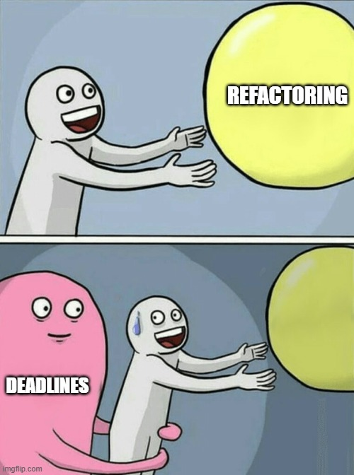
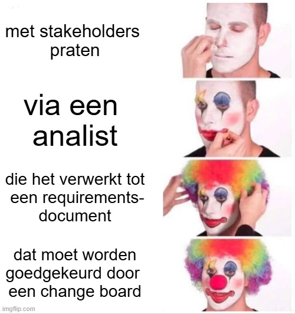
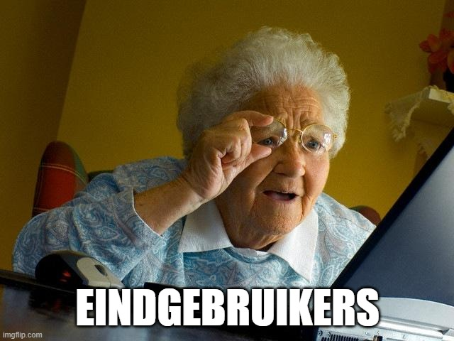

*Voor een sessie over bedrijfscultuur maakte kunstenaarscollectief 'enkele collega's en ik' een aantal memes. Deze hadden als doel de lachspieren te trainen en tot discussie te prikkelen. Onderstaand een virtuele expositie.*



## Zaal 1: dev

Het collectief stipt de spanning aan tussen de belangen van het ontwikkelteam en die van haar opdrachtgever. Daarbij valt op dat het ontwikkelteam de oorzaak van hun ongenoegen veelal buiten zichzelf zoekt. Het derde werk, *takkebranches*, toont echter snedig dat ook ontwikkelaars zelf een aandeel hebben in de pijn die zij ervaren.

 



## Zaal 2: deploy

Het collectief richt zijn pijlen op deployment van software. Het merkt op dat dit met '*panik*' gepaard gaat. (Dit is internettaal voor 'paniek'.) De oorzaak hiervan ligt, in de diagnose van het collectief, opnieuw niet buiten het team zelf. In *scrolling scrolling scrolling (yeah!)* wijzen ze erop dat grote wijzigingen deployments een risicovolle onderneming maken. Of de voorgestelde oplossing, het bemoeilijken van deployments, dit probleem zal verhelpen, laat men een opgave voor de toeschouwer.

 



## Zaal 3: proces

Het collectief hekelt de logge processen die op zijn gezet en de vele overleggen die daarbij gepaard gaan. Het resultaat van deze werkwijze zal sardonisch worden gepresenteerd in Zaal F.

 



## Zaal D: cultuur

De oorspronkelijke opdracht van het collectief was een bedrijfscultuur in kaart te brengen. Het collectief heeft hier jammerlijk in gefaald door alle tijd te steken in het maken van memes. Het collectief is uit zijn functie ontheven. Het collectief betreurt dit ten zeerste. 

 



## Zaal F: resultaat

Ik vraag u: *Cui bono?*

 



## Afsluitend

