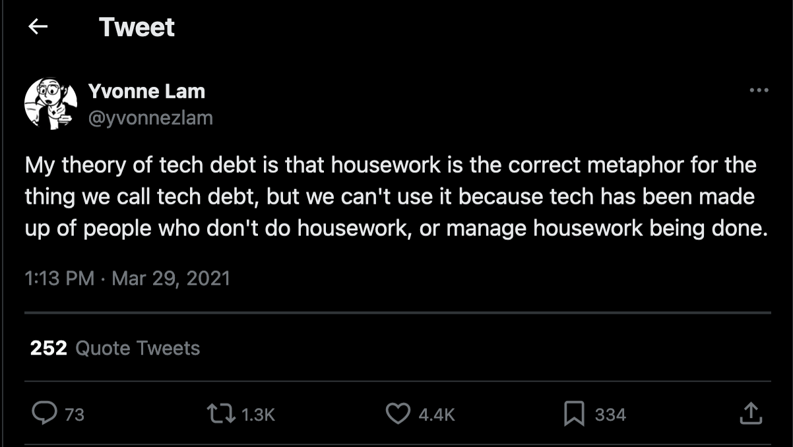

Wat kunnen [Hannah Arendts](https://plato.stanford.edu/entries/arendt/ "'Hannah Arendt', Stanford Encyclopedia of Philosophy") [filosofische](/tags/filosofie/ "Blogs met de tag 'filosofie'") overpeinzingen ons leren over [refactoring](/tags/refactoren/ "Blogs met de tag 'refactoren'")? Nou, bijvoorbeeld waarom de metafoor van [technische schuld](/tags/technische-schuld/ "Blogs met de tag 'technische schuld'") een misleidende is. Maar als refactoring niet het afbetalen van technische schuld is, wat is het dan wel? En wat betekent dat voor de rol die refactoring in onze dagelijkse werkzaamheden in mag (of moet?) nemen?[^1]



Deze blog behandelt drie vragen.

## 1. Wat is refactoring?

[Martin Fowler](https://martinfowler.com/) geeft in zijn klassieke [*Refactoring*](https://martinfowler.com/books/refactoring.html "'Refactoring: Improving the Design of Existing Code (Second Edition)', Martin Fowler (with Kent Beck), Addison Wesley 2019")[^2] de volgende [definities](https://martinfowler.com/bliki/DefinitionOfRefactoring.html "'Definition Of Refactoring', Martin Fowler") van het titelbegrip:

> **Refactoring** *(noun)*: a change made to the internal structure of software to make it easier to understand and cheaper to modify without changing its observable behavior.
>
> **Refactoring** *(verb)*: to restructure software by applying a series of refactorings without changing its observable behavior.

"Refactoring" kan zowel een zelfstandig naamwoord als een werkwoord zijn. Het is zowel een ding als een activiteit.

Als zelfstandig naamwoord verwijst het naar een wijziging in de structuur van de code zonder het observeerbare gedrag te veranderen. Het soort wijzigingen waar Fowler op doelt zijn behoorlijk atomair: het extraheren of inlinen van een methode of class, of het verplaatsen van een method van een subclass naar een baseclass of juist andersom.

Als werkwoord verwijst "refactoring" naar het herhaaldelijk toepassen van dit soort atomaire wijzigingen. Fowlers karakterisering is zeer bewust gekozen. Refactoring vindt plaats in een *reeks* van *kleine stappen*. (Zie ook [deze blog](/blog/22/08/twee-stijlen-van-refactoren/ "'Twee stijlen van refactoren'")). Gedurende elke stap blijft het systeem in een functionerende staat. De testsuite die als [vangnet](/blog/22/09/tests-als-vangnet/ "'Tests als vangnet'") dient voor je wijzigingen, dient gedurende de refactoring te allen tijden groen te blijven.

In de [popcultuur van ons vakgebied](/blog/25/02/softwareontwikkeling-is-een-popcultuur-maar-hoeft-dat-niet-te-zijn/ "'Softwareontwikkeling is een popcultuur (maar hoeft dat niet te zijn)'") is dit inzicht veelal genegeerd of verloren gegaan. Refactoring wordt vaak als synoniem gebruikt voor "het wijzigen van code" -- meestal in grote sprongen die het systeem lange tijd in gebroken staat houden. Ook het gedragsbehoudende karakter van refactoring wordt vaak over het hoofd gezien. Hoe vaak wordt er niet gerefactord -- zonder tests, op hoop van zegen?[^3]



Wat doen we als we refactoren? Een veelgehoorde metafoor is: refactoren is het terugbetalen van [technische schuld](/tags/technische-schuld/ "Blogs met de tag 'technische schuld'"). Gedurende het ontwikkelen van nieuwe features, bouwen we een schuld op in de code. Het is nodig die schuld te maken om vooruit te komen. Wanneer de feature geïmplementeerd is en waarde oplevert, bouwen we de schuld af door de code te herstructureren om de nieuwe en oude features goed met elkaar te integreren.

*Technische schuld* is een metafoor, een [mentaal model](/tags/mentaal-model/ "Blogs met de tag 'mentaal model'") dat onze praktijk van refactoren binnen een betekenisvol kader plaatst. De metafoor stelt ons in staat om uit te leggen waarom we refactoren: omdat het op den duur ondoenlijk wordt onder de last van grote schulden te leven.

Is de schuldmetafoor de juiste om onze praktijk van refactoren te beschrijven? Het beeld brengt de noodzaak van refactoring sterk over, en dat verklaart wellicht haar succes. (-- Hoewel, wijst de alomtegenwoordigheid van technische schuld in ons vakgebied er niet op dat de metafoor zijn uiteindelijke doel toch gemist heeft?)

De metafoor schuurt ook. Waar ik me vaak over verbaasd heb, is het gemak waarmee teams technische schuld introduceren. Het afsluiten van een hypotheek gaat gepaard met uitgebreide documentatie die de bank bewijst dat je in staat bent de lening terug te betalen. Maar in de softwareontwikkeling gelden er blijkbaar andere regels -- of in elk geval: een stuk minder regels. Elke ontwikkelaar is op elk moment in staat zoveel technische schuld te introduceren als hem of haar goeddunkt. De enige remmende factor is het "technisch-financiële" verantwoordelijkheidsgevoel van de rest van het team.

Een plan om technische schuld terug te betalen heb ik nog nooit gezien. Informeel wordt er van tijd tot tijd misschien geroepen: "als die feature af is, dan moeten we wel de tijd nemen om de schuld weg te werken" -- natuurlijk. Maar wanneer het moment daar is, staat de volgende feature voor de deur, en wordt de technische schuld wat verder naar beneden geschoven op de backlog. (Zie ook [deze blog](/blog/22/06/het-probleem-met-technische-schuld-op-je-backlog/ "'Het probleem met technische schuld op je backlog'").)

Technische schuld lijkt nooit *definitief* te worden afbetaald. Elke keer als een refactorslag in de ene hoek van de code de schuld omlaag heeft gebracht, wordt er op een andere plek in de code weer nieuwe schuld geïntroduceerd. Na 30 jaar is een hypotheek afbetaald; maar een systeem dat die leeftijd haalt, heeft waarschijnlijk meer technische schuld dan ooit.

Een laatste probleem met de metafoor is dat, door refactoring in fincanciële termen te kaderen, het risico bestaat dat de verantwoordelijkheid voor het starten van een refactoring bij de business komt te liggen. Het is immers hun geld dat daarbij uitgegeven wordt. Dus het is niet meer dan logisch dat zij mogen beslissen: wil je het uitgeven aan een nieuwe feature of aan onderhoud voor het systeem? Het antwoord op die vraag laat zich vaak raden.



[Yvonne Lam](https://x.com/yvonnezlam "@yvonnezlam, X") stelt in een -- inmiddels verwijderde -- tweet (uit de tijd dat X nog Twitter heette) een andere metafoor voor:

 

 

Twee dingen: (1) *shots fired*; (2) --

 

 

De karakterisatie refactoring-als-huishouding klonk mij op het moment dat ik 'm voor het eerst hoorde, onmiddellijk een stuk intuïtiever in de oren dan de bekende schuldmetafoor. En inderdaad gebruiken we deze metafoor aan de lopende band, wanneer we zeggen dat we die en die hoek van de code even *op moeten ruimen* omdat deze een *rommeltje* is geworden. ([Kent Becks](https://www.kentbeck.com/) laatste boek gaat over refactoring en heet -- let op! -- [*Tidy First?*](https://www.oreilly.com/library/view/tidy-first/9781098151232/ "Kent Beck, 'Tidy First?: A Personal Exercise in Empirical Software Design', O'Reilly Media, 2023"). Het was [mijn favoriete boek van 2024](/blog/24/12/de-beste-boeken-over-software-ontwikkeling-die-ik-in-2024-las/ "'De beste boeken over software ontwikkeling die ik in 2024 las'").)

Maar dat laat de vraag onbeantwoord: waarom is deze metafoor intuïtiever dan de schuldmetafoor? -- Dat brengt me bij de volgende vraag.

## 2. Wat is Hannah Arendt?

[Hannah Arendt](https://plato.stanford.edu/entries/arendt/ "'Hannah Arendt', Stanford Encyclopedia of Philosophy") (1906-1975) was een Duits-Amerikaans Joods filosofe en politiek denker. Ze is bekend van haar fantastische studie naar de grote totalitaire systemen van de twintigste eeuw, [*The Origins of Totalitarianism*](https://en.wikipedia.org/wiki/The_Origins_of_Totalitarianism "'The Origins of Totalitarianism', Wikipedia"), en muntte de beroemde frase "de banaliteit van het kwaad" in haar verslag van het proces van [Adolf Eichmann](https://en.wikipedia.org/wiki/Adolf_Eichmann "'Adolf Eichmann', Wikipedia") in [*Eichmann in Jerusalem*](https://en.wikipedia.org/wiki/Eichmann_in_Jerusalem "'Eichmann in Jerusalem', Wikipedia").

Maar we gaan het vandaag niet hebben over Arendts politieke filosofie. Vandaag bespreken we haar fenomenologische onderzoek naar het actieve leven in [*The Human Condition*](https://en.wikipedia.org/wiki/The_Human_Condition_(Arendt_book) "'The Human Condition (Arendt book)', Wikipedia"). Arendt contrasteert het *vita activa* met het *vita contemplativa*. De filosofie heeft zich traditioneel op dat laatste geconcentreerd, en daarmee een blinde vlek gecreëerd voor het eerste. Arendt tracht die met haar boek te corrigeren.



In *The Human Condition* maakt de filosofe een onderscheid tussen *arbeid* en *werk*. Op het eerste gezicht klinkt dat vreemd, want wie de [Van Dale](https://www.vandale.nl/) erop naslaat, ziet dat beide synoniemen zijn van elkaar:

> [**ar·beid**](https://www.vandale.nl/gratis-woordenboek/nederlands/betekenis/arbeid) *(de; m)*: moeite, inspanning van geestelijke of lichamelijke aard; = beroepsbezigheid, werk
>
> [**werk**](https://www.vandale.nl/gratis-woordenboek/nederlands/betekenis/werk) *(het; o)*: het werken; = arbeid

Het zou toeval kunnen zijn dat het Nederlands twee woorden kent om hetzelfde fenomeen te beschrijven. Maar Arendt wijst erop dat het geen gril van onze taal is. Hetzelfde onderscheid vinden we terug in het Duits (*Arbeit*--*Werk*), Engels (*labour*--*work*), Frans (*travailler*--*ouvrer*), en zelfs in het Grieks (*ponein*--*ergazesthai*) en Latijn (*laborare*--*facere*). Dat wijst op een fenomenologisch onderscheid dat we niet bewust herkennen, maar desalniettemin als gestolde wijsheid in onze taal is verankerd.

Wat is het verschil tussen arbeid en werk? 

Arbeid heeft een associatie met pijn en fysieke inspanning, met de last van het bestaan -- denk aan dingen als het land bewerken of bevallen (nota bene: *going into labour*!). De wereld van arbeid is die van het *animal laborans*: het beestachtig bestaan waarin er gebikkeld moet worden om te overleven. Arbeid is een gevecht tegen entropie, zou je kunnen zeggen: er is een constante (of op zijn minst steeds terugkerende) inspanning voor nodig om de machine van het leven draaiende te houden. Dit werkt door in de opvatting van tijd die zo'n bestaan met zich meebrengt: die is cyclisch, hij wordt gekenmerkt door de afwisseling van perioden van inspanning en rust.

Werk heeft daarentegen een associatie met het maken van dingen -- het creëren van machines of kunstwerken. Dit is het domein van de *homo faber*: de mens die werktuigen maakt in een poging die last van het bestaan te verminderen. De opvatting van de tijd die deze vorm van inspanning met zich meebrengt is een lineaire: de werkende mens werkt toe[^4] naar een einddoel. Als dat doel eenmaal is behaald, is het einde verhaal wat het werk betreft: de machine doet zijn ding of het kunstwerk wordt geëxposeerd.



Het onderscheid tussen arbeid en werk is vaak over het hoofd gezien -- en Arendts boek staat vol met voorbeelden van filosofen die het eerste tot het laatste proberen te reduceren. Maar we hoeven niet de filosofiegeschiedenis in te duiken om er een goed voorbeeld van te vinden. 

Wie heeft er nooit verzucht: "Waarom zou ik vandaag stoffen (*of* afwassen *of* het gras maaien)? Morgen (*of* overmorgen *of* volgende week) mag ik het toch weer opnieuw doen." Zo'n uitroep komt voort uit een verwarring van arbeid met werk. Hij drukt de wens uit een bepaalde last voor eens en altijd te lijf te gaan, en plakt daarmee een lineair tijdsbegrip op een fenomeen dat vanuit zijn aard nu eenmaal cyclisch is. De last van het bestaan wordt zo alleen maar zwaarder, want deze wordt zo vermenigvuldigd met onze eigen onrealistische en ongepaste verwachtingen.[^5]

Dat betekent natuurlijk niet dat we alle last (en de arbeid die nodig is om die te beteugelen) kritiekloos moeten accepteren. We kunnen *werken* om de last te verminderen: door een stofzuiger uit te vinden of een afwasmachine of een grasmaaier, bijvoorbeeld. Het maken van die hulpmiddelen heeft een duidelijk einddoel. Op een gegeven moment zijn ze klaar en kunnen ze (een deel van) de arbeid van ons overnemen.

Maar merk op dat, hoewel deze machines onze arbeid verminderen, ze de last niet *helemaal* wegnemen: want er is nog altijd iemand nodig die de stofzuiger en grasmaaier bedient (of, in het geval van zelfsturende varianten, te werk stelt), en de afwasmachine inlaadt en aanzet. Arbeid is een constante in het *vita activa*; maar de hoeveelheid tijd die we eraan kwijt zijn is variabel, afhankelijk van de omstandigheden.

## 3. Wat nu?

Wat betekenen deze reflecties voor de praktijk van het refactoren? Laten we die vraag met een omweg beantwoorden.

Huishouding is een vorm van arbeid. Poetsen, stoffen, koken, afwassen: het zijn terugkerende taken die worden gekenmerkt door perioden van inspanning en rust. Een schuld afbetalen is een vorm van werk. Het is een taak met een duidelijk begin- en eindpunt: het op zich nemen van de schuld en het volledig afbetaald hebben ervan.

Waarom is huishouding een betere metafoor voor refactoren dan het afbetalen van een schuld? Refactoring is een cyclisch proces, een steeds opnieuw terugkerende taak die nodig is om de machine van het uitbreiden van een softwaresysteem[^6] draaiende te houden. Refactoring is een vorm van arbeid, en niet een vorm van werk.



Is het belangrijk om refactoring met de juiste metafoor te kaderen? Ik kan alleen voor mezelf spreken: sinds ik refactoring als huishouding ben gaan zien, in plaats van als het terugbetalen van technische schuld, is mijn verhouding tot de praktijk aanzienlijk veranderd.

Waar gewerkt wordt, wordt rommel gemaakt -- sterker nog: waar (slechts) *geleefd* wordt, wordt rommel gemaakt. Het hoeft dus niet te verbazen dat de constante stroom aan wijzigingen die we in een codebase doorvoeren, ertoe leiden dat we regelmatig op moeten ruimen. Wie refactoring als huishouding ziet, hoeft zich niet langer te verbazen over de mate waarin "technische schuld" wordt geïntroduceerd in een codebase. Het *is* geen technische schuld, het is code die (nog) niet is opgeruimd -- meer niet.

Wie rommel tegenkomt, ruimt het op -- de [*boy scout rule*](https://martinfowler.com/bliki/OpportunisticRefactoring.html "'Opportunistic Refactoring', Martin Fowler"). Dat geldt idealiter voor je eigen code, nadat je een feature hebt geïmplementeerd, maar het geldt ook voor andermans code, voordat je een feature toevoegt. Terugbetaalplannen zijn niet-bestaand omdat ze niet nodig zijn wanneer de code wordt gezien als werkblad in plaats van schuld.

Opruimen is nooit definitief klaar -- niet zolang er geleefd en gewerkt wordt, in elk geval. Dus het hoeft niet te verbazen dat we nooit definitief klaar zijn met refactoren. De metafoor van technische schuld impliceert dat we ons werk onverantwoord doen, wanneer we code introduceren die refactoring noodzaakt. De boodschap van de huishoudmetafoor is aanzienlijk vriendelijker: dit is een normaal onderdeel van het proces; het is onze verantwoordelijkheid die last te dragen.

En dat brengt me bij het belangrijkste verschil. Door refactoring in termen van huishouding te kaderen, komt de verantwoordelijkheid voor het opruimen van de code terug te liggen bij het ontwikkelteam zelf. Natuurlijk, het is nog steeds het geld van je stakeholders dat je uitgeeft wanneer je tijd spendeert aan refactoren in plaats van aan nieuwe features. Maar het geld gaat naar het onderhoud van het systeem (*viz.* het opruimen en schoonhouden van de werkplaats) -- een inherent onderdeel van het werk en niet een gevolg van technisch-financiële nalatigheid.

Sinds ik refactoring als huishouding ben gaan zien, en de metafoor van technische schuld los ben gaan laten, *ben ik meer gaan refactoren*. Dat heeft me een betere softwareontwikkelaar gemaakt en is de kwaliteit van het systeem ten goede gekomen.



Toch wil ik niet suggereren dat er helemaal geen plek is voor het idee van technische schuld -- alleen het toepassingsgebied ervan is kleiner dan op voorhand gedacht.[^7] Technische schuld is wanneer de business een beslissing maakt om een bepaalde hoek af te snijden in (de ontwikkeling van) het softwaresysteem *met een concreet doel voor ogen* én *met een plan om de schuld terug te betalen*. 

De business kan oordelen: om die ene grote klant binnen te halen (= concreet doel), moeten we feature *x* nú implementeren. De refactoring van het model die ervoor nodig zou zijn om dat goed in het systeem te integreren, slaan we voorlopig over, omdat de tijdspanne voor deze kans zeer beperkt is. Maar zodra de klant eenmaal binnen is, ruimen we tijd in om de refactoring achteraf te doen, waarbij we accepteren dat dat impact heeft op de levertijd van de andere features die op de planning staan  (= terugbetaalplan).

Een ontwikkelteam moet alleen met technische schuld akkoord gaan als de schuld verantwoord gemaakt wordt. Zo niet, dan dient het team een ferm nee te verkopen. Technische schuld mag nooit -- *nooit!* -- een excuus zijn om verstandige zaken als [testen](/tags/testen/ "Blogs met de tag 'testen'") of codekwaliteit overboord te gooien. Het feit dat je schuld maakt betekent niet dat je geen [vakman](/tags/vakmanschap/ "Blogs met de tag 'vakmanschap'") meer hoeft te zijn. 

[^1]: Deze blog schreef ik ter voorbereiding op een *lightning talk* die ik gaf op [Nimma Codes](https://www.nimma.codes/).

[^2]: Het boek schopte het aanvankelijk slechts tot een eervolle vermelding in [de lijst van beste softwareboeken die ik in 2021 las](/blog/21/12/de-beste-boeken-over-software-ontwikkeling-die-ik-in-2021-las/ "'De beste boeken over software ontwikkeling die ik in 2021 las'"), maar later kwam ik tot inkeer en [concludeerde alsnog](/blog/24/02/een-herwaardering-van-fowlers-refactoring/ "'Een herwaardering van Fowlers Refactoring'") dat *Refactoring* zijn klassiekerstatus dubbel en dwars verdient.

[^3]: Het hoeft dan ook niet te verbazen dat Fowlers karakterisatie op [Refactoring.com](https://refactoring.com/), meer nog dan in zijn oorspronkelijke definities, de nadruk legt op deze aspecten (mijn cursiveringen): <blockquote>
Refactoring is a *disciplined* technique for restructuring an existing body of code, altering its internal structure without changing its external behavior.

Its heart is a *series* of *small behavior preserving transformations*. *Each transformation (called a "refactoring") does little*, but a sequence of these transformations can produce a significant restructuring. Since each refactoring is small, it's less likely to go wrong. *The system is kept fully working after each refactoring*, reducing the chances that a system can get seriously broken during the restructuring.
</blockquote> Deze visie op refactoren is expliciet gecodeerd, zou je kunnen zeggen, in de workflow van [TDD](/tags/test-driven-development/ "Blogs met de tag 'test-driven development'").

[^4]: *No pun intended* -- maar je vraagt je haast af: is dit een hint dat het lineaire tijdsbeeld van werk inderdaad in onze taal verankerd is?

[^5]: Dat het onze eigen verwachtingen zijn die ons laten lijden, was een inzicht dat al bekend was bij de oude [stoïcijnen](https://plato.stanford.edu/entries/stoicism/ "'Stoicism', Stanford Encyclopedia of Philosophy"). [Epictitus](https://plato.stanford.edu/entries/epictetus/ "'Epictitus', Stanford Encyclopedia of Philosophy"): "Wens niet dat de dingen gebeuren zoals jij wil; maar wens dat de dingen die gebeuren zijn zoals ze zijn, en je zult een rustig leven leiden."

[^6]: Merk op dat "machine" hier niet verwijst naar de software, maar het [sociotechnische systeem](https://en.wikipedia.org/wiki/Sociotechnical_system "'Sociotechnical system', Wikipedia") dat ervoor verantwoordelijk is de software te ontwikkelen. De software is daar een onderdeel van, uiteraard, maar dat geldt net zo zeer voor de ontwikkelaars (die de software wijzigen) en de eindgebruikers (die de software gebruiken en op basis daarvan nieuwe wensen formuleren).

[^7]: Deze gedachten ontleen ik aan [dit praatje](https://www.youtube.com/watch?v=u6s8S63OOIE "'The Technical Debt Trap • Doc Norton • YOW! 2017' @ YouTube") van [Doc Norton](https://docondev.com/). 